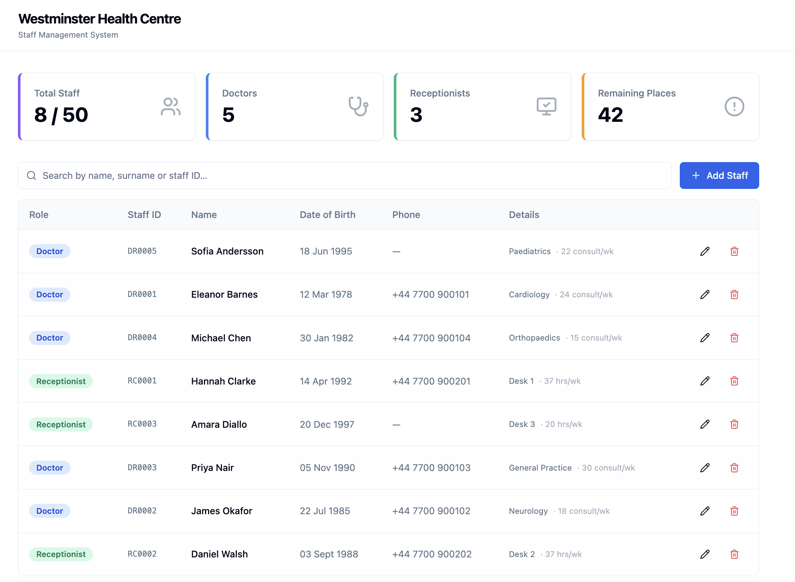

# Westminster Health Centre — Staff Management System

A full-stack web application for managing doctors and
receptionists at the Westminster Health Centre. 



---

## Live Demo

| | URL |
|---|---|
| **Frontend** | https://health-centre-application.vercel.app/ |
| **API** | https://healthcentreapplication-production.up.railway.app/ |
| **Swagger UI** | https://healthcentreapplication-production.up.railway.app/swagger-ui|

---

## Tech Stack

### Backend
| Technology | Purpose |
|---|---|
| Java 17 | Language |
| Spring Boot 3.2 | Application framework |
| Spring Data JPA + Hibernate | ORM and database access |
| PostgreSQL | Production database |
| Bean Validation | Request validation |
| SpringDoc OpenAPI | Auto-generated Swagger UI |
| JUnit 5 + Mockito | Unit and integration testing |
| H2 | In-memory database for tests |

### Frontend
| Technology | Purpose |
|---|---|
| React 18 + TypeScript | UI framework |
| Vite | Build tool |
| Tailwind CSS + shadcn/ui | Styling and components |
| React Hook Form + Zod | Form handling and validation |
| Lucide React | Icons |

---

## Features

- **Add, edit and remove** doctors and receptionists
- **Live search** — filter staff by name, surname or staff ID
- **Stats dashboard** — total staff, doctors, receptionists and remaining capacity
- **Role badges** — colour-coded Doctor / Receptionist labels
- **Form validation** — client-side (Zod) and server-side (Bean Validation) with consistent error messages
- **Sample data** — 8 staff members seeded on first startup
- **Swagger UI** — interactive API documentation at `/swagger-ui`
- **REST API** — full CRUD with proper HTTP status codes and a consistent error envelope

---

## Project Structure

```
westminster-health-centre/
├── westminster-health-backend/     Spring Boot REST API
│   ├── src/main/java/com/westminster/healthcentre/
│   │   ├── config/                 CORS, OpenAPI, DataSeeder
│   │   ├── controller/             REST endpoints
│   │   ├── dto/                    Request / response records
│   │   ├── exception/              Typed exceptions + global handler
│   │   ├── model/                  JPA entities (StaffMember, Doctor, Receptionist)
│   │   ├── repository/             Spring Data JPA repository
│   │   └── service/                Business logic
│   └── src/test/                   JUnit 5 unit + integration tests
│
├── westminster-health-frontend/    React frontend
│   └── src/
│       ├── api/                    Fetch calls (staffApi.ts)
│       ├── types/                  TypeScript interfaces
│       ├── hooks/                  Custom hooks (useHealthCentreData)
│       └── components/             UI components
│
├── assets/                         Screenshots
├── .gitignore
└── README.md
```

---

## API Reference

| Method | Endpoint | Description |
|---|---|---|
| `GET` | `/api/staff` | List all staff (optional `?search=`) |
| `GET` | `/api/staff/stats` | Counts and remaining capacity |
| `GET` | `/api/staff/{staffId}` | Get a single staff member |
| `POST` | `/api/staff/doctors` | Add a new doctor |
| `POST` | `/api/staff/receptionists` | Add a new receptionist |
| `PUT` | `/api/staff/doctors/{staffId}` | Update an existing doctor |
| `PUT` | `/api/staff/receptionists/{staffId}` | Update an existing receptionist |
| `DELETE` | `/api/staff/{staffId}` | Remove a staff member |

All errors return a consistent JSON envelope:
```json
{
  "status": 404,
  "message": "No staff member found with ID 'DR9999'.",
  "timestamp": "2025-01-15T10:30:00Z"
}
```

---

## Running Locally

### Prerequisites
- Java 17+
- Maven 3.8+
- Node.js 18+
- PostgreSQL (or Docker)

### 1 — Start the database

**Using Docker:**
```bash
docker run --name healthcentre-db \
  -e POSTGRES_DB=healthcentre \
  -e POSTGRES_PASSWORD=password \
  -p 5432:5432 -d postgres:16
```

**Using an existing PostgreSQL installation:**
```bash
psql -U postgres -c "CREATE DATABASE healthcentre;"
```

### 2 — Configure environment variables

Create `westminster-health-backend/.env`:
```
DATABASE_URL=jdbc:postgresql://localhost:5432/healthcentre
DB_USERNAME=postgres
DB_PASSWORD=your_password
```

### 3 — Start the backend
```bash
cd westminster-health-backend
mvn spring-boot:run
```

API runs on `http://localhost:8080`.
Swagger UI at `http://localhost:8080/swagger-ui`.

### 4 — Start the frontend
```bash
cd westminster-health-frontend
npm install
cp .env.example .env.local   # already points to localhost:8080
npm run dev
```

Frontend runs on `http://localhost:5173`.

---

## Running Tests

```bash
cd westminster-health-backend
mvn test
```

Tests use an H2 in-memory database — no PostgreSQL needed. The suite includes:

- **Unit tests** (`StaffServiceImplTest`) — Mockito mocks, no Spring context, fast
- **Integration tests** (`StaffControllerIntegrationTest`) — full Spring context, MockMvc hitting real endpoints against H2

---

## Architecture Decisions

### Why SINGLE_TABLE inheritance?
Doctor and Receptionist share most fields and the total row count is small (≤50). SINGLE_TABLE avoids joins, keeps queries fast, and the schema simple. A discriminator column (`staff_type`) tells Hibernate which subtype to instantiate on read.

### Why a service interface?
`StaffController` depends on `StaffService` (the abstraction), not `StaffServiceImpl` (the implementation). This means unit tests can mock the interface without needing Spring or a database — keeping them fast and focused on business logic.

### Why DTOs instead of exposing entities directly?
JPA entities carry database concerns (lazy-loading proxies, discriminator columns, internal IDs). Exposing them from the API leaks implementation details. DTOs are plain Java records containing exactly what the API consumer needs.

### Why typed exceptions?
Each exception (`StaffNotFoundException`, `DuplicateStaffIdException`, `StaffLimitReachedException`) maps to a specific HTTP status in `GlobalExceptionHandler`. Controllers contain no try/catch blocks — error handling is centralised.

### Why plain React hooks instead of a state management library?
The application state is simple — a list of staff and a stats summary owned by `App`, passed down as props. `useState`, `useEffect`, and `useCallback` are sufficient. Adding Redux or TanStack Query would introduce complexity without solving a real problem at this scale.

### Why client-side search instead of a new API request per keystroke?
The dataset is capped at 50 records. Filtering an already-fetched array in memory is instant and avoids unnecessary network requests. A server-side search endpoint (`?search=`) is still available for use from the Swagger UI or external clients.

---

## Deployment

### Backend → Railway
1. Push to GitHub
2. Create a new Railway project → Deploy from GitHub repo
3. Add a PostgreSQL plugin — Railway injects `DATABASE_URL` automatically
4. Set environment variables:
   ```
   DB_USERNAME=postgres
   DB_PASSWORD=<from Railway PostgreSQL plugin>
   CORS_ALLOWED_ORIGINS=https://your-frontend.vercel.app
   ```

### Frontend → Vercel
1. Import the GitHub repo on Vercel
2. Set root directory to `westminster-health-frontend`
3. Add environment variable:
   ```
   VITE_API_URL=https://your-api.railway.app
   ```
4. Deploy — Vercel detects Vite automatically

---
